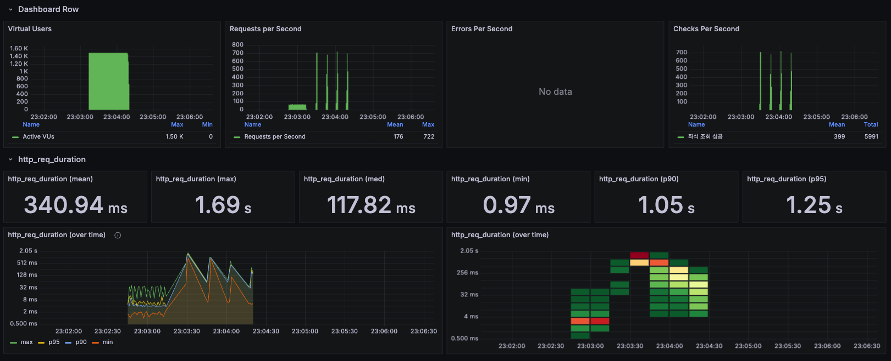

# 콘서트 예약 프로젝트
이 시스템은 토큰 기반의 인증 및 대기열 관리 방식을 사용하여 유저가 공정하게 좌석을 예약할 수 있도록 하며, 실시간으로 예약 처리 및 결제 관리를 효율적으로 지원하는 것을 목표로 하고있습니다. 
시스템은 유저의 예약 및 결제 상태에 대한 관리, 잔고 충전 기능, 그리고 예약 실패 시 점유한 좌석 취소와 같은 비즈니스 로직을 내포하고 있습니다.    

- 토큰 기반 인증 및 대기열 관리: 유저의 토큰을 발급하여 토큰의 유효 기간 동안 예약, 좌석 조회 등 특정 기능을 제한적으로 제공. 이를 통해 동시성 문제를 해결하고, 불필요한 시스템 자원을 절약하며 공정한 처리를 보장합니다.
- 예약 상태 관리 및 자동 취소: 유저가 예약 후 결제를 진행하지 않으면, 결제 대기 시간이 지나면 자동으로 예약을 취소하고 해당 좌석을 오픈합니다. 예약 성공 후 결제까지의 시간을 관리하여 유저의 유효한 토큰을 처리합니다.
- 잔고 충전 및 결제: 토큰 없이도 잔고 충전 및 예약 조회, 결제가 가능하지만, 예약 후 결제 시에는 유효한 토큰을 필수로 사용하여 보안성을 강화하고 실시간 결제를 처리합니다.
- 유효한 토큰 만료 처리: 예약 후 결제 시 유저의 토큰은 만료됩니다. 유효한 토큰을 통한 예약 후 결제 상태까지의 흐름을 관리하여 유저의 데이터를 보호하고, 안정적인 시스템 운영을 보장합니다.
- 확장성 및 트랜잭션 관리: 시스템의 확장성을 고려하여 트랜잭션 관리를 통해 데이터 일관성을 유지하며, 예약 및 결제 중 발생할 수 있는 경합 상태를 방지하도록 설계되었습니다. 클린 아키텍처를 통해 유지보수와 확장성 또한 고려되었습니다.
  
## 서비스 설계
### 요구사항
- 유저 토큰 발급 API
- 예약 가능 날짜 / 좌석 API
- 좌석 예약 요청 API
- 잔액 충전 / 조회 API
- 결제 API
- 각 기능 및 제약사항에 대해 단위 테스트를 반드시 하나 이상 작성
- 다중 서버, 동시성 이슈를 고려
- 대기열 개념을 고려해 구현
### [Milestone](https://github.com/users/JoYuKang/projects/5)
### [Sequence Diagram](https://github.com/JoYuKang/Concert_Reservation/blob/docs/docs/%EC%8B%9C%ED%80%80%EC%8A%A4%20%EB%8B%A4%EC%9D%B4%EC%96%B4%EA%B7%B8%EB%9E%A8.md)
### [ERD](https://github.com/JoYuKang/Concert_Reservation/blob/main/docs/ERD.md)
### [API 명세서](https://github.com/JoYuKang/Concert_Reservation/blob/docs/docs/API%20%EB%AA%85%EC%84%B8%EC%84%9C.md)
### [플로우차트](https://github.com/JoYuKang/Concert_Reservation/blob/docs/docs/%ED%94%8C%EB%A1%9C%EC%9A%B0%20%EC%B0%A8%ED%8A%B8.md)

[//]: # (### [콘서트 조회 성능 개선 보고서]&#40;#콘서트-조회-성능-개선-보고서&#41;)
[//]: # (### [서비스의 규모 확장을 위한 MSA 적용 방식 정리]&#40;#서비스의-규모-확장을-위한-MSA-적용-방식-정리&#41;)
## 페키지 구조
```
src/
├── support/
│   ├── common/ 
│          └── entity/                 # 공통 엔티티
│   ├── exception/                     # 예외 관리                  
│   ├── config/
│   │   ├── jpa/
│   │   ├── web/
│   ├── interceptor
│   ├──    http/                       # 유틸리티
│            └─ CommonResponse.java 
├── member/                   
│   ├── domain/
│   │   ├── Member.java.                 # Member 엔티티
│   │   ├── memberService.java.          # Member 서비스 
│   │   ├── MemberRepository.java.       # Member Interface   
│   ├── application
│   │   ├── facade
│   │   ├── Service
│   │   │   ├── memberService.java.          # Member 서비스 구현체
│   ├── interfaces/ 
│   │   ├── MemberController.java
│   │   ├── dto
│   │   │   ├── request
│   │   │   │   ├── MemberRequest.java
│   │   │   ├── response
│   │   │   │   ├── MemberResponse.java
└────── infrastructure/
        └── MemberJPARepository.java

```
## API Swagger

### 유저의 토큰 발급 API


### 유저의 토큰 조회 API


### 유저의 조회 API


### 유저의 충전 요청 API


### 유저의 예약 요청 API


### 유저의 예약 결제 요청 API


### 유저의 예약 내역 조회 API


### 콘서트 이름 조회 API


### 콘서트 일자 조회 API


### 콘서트 좌석 조회 API


## 동시성 문제는 왜 발생하는가?

컴퓨터는 마치 여러 가지 일을 동시에 처리하는 것처럼 보이지만, 실제로는 한 번에 하나의 작업씩 순차적으로 처리하고 있습니다. 이 과정에서 동일한 데이터에 대해 여러 트랜잭션이 동시에 접근하거나 수정하려고 시도하면, 데이터의 정합성에 문제가 발생할 수 있습니다.

예를 들어, 두 트랜잭션이 동시에 같은 데이터를 읽고, 각각 수정한 뒤 저장하려고 하면, 한쪽의 수정 내용이 덮어씌워지거나 의도치 않은 값이 저장될 위험이 있습니다. 이러한 동시성 문제는 데이터 일관성을 위협하며 시스템의 안정성과 신뢰성을 저하시킬 수 있습니다.

이러한 이슈를 해결하기 위해 낙관적 락, 비관적 락, 레디스 등 다양한 방법으로 동시성을 해결하고 있습니다. 각각의 방법은 장단점이 있기 때문에 비즈니스 요구사항에 맞춰 데이터의 일관성을 유지하면서도 성능을 고려한 선택을 해야 합니다.

---

## 낙관적 락과 비관적 락 비교

| 특징           | 낙관적 락 (Optimistic Lock)                                                    | 비관적 락 (Pessimistic Lock)                                                  |
|----------------|-------------------------------------------------------------------------------|-------------------------------------------------------------------------------|
| 개념           | 데이터 읽을 때 락을 걸지 않으며, 변경 시 충돌 여부 확인 후 재시도 또는 실패 처리 | 데이터를 읽을 때 바로 락을 걸어 다른 트랜잭션이 데이터에 접근하지 못하게 함     |
| 충돌 처리 방식 | 충돌 발생 시 예외를 던지고, 재시도 로직이나 다른 처리 로직으로 문제를 해결         | 충돌 방지를 위해 트랜잭션 종료 시까지 데이터 락 유지                         |
| 사용 상황      | 충돌이 드물고 다중 사용자 환경에서 높은 동시성 보장이 필요한 경우               | 충돌 가능성이 높고 데이터 정합성이 중요한 경우                               |
| 성능           | 데이터 충돌이 적은 경우 성능 우수                                              | 락으로 인한 대기 시간 증가로 트랜잭션 처리량 감소                            |
| 락 방식        | DB 버전 필드(@Version)나 타임스탬프 활용                                       | DB의 S-Lock 또는 X-Lock 활용                                                |
| 장점           | 높은 동시성 처리 가능, 오버헤드 감소                                           | 데이터 정합성 보장                                                           |
| 단점           | 충돌이 빈번하면 재시도로 인한 성능 저하                                        | 대기 시간 증가, 데드락(Deadlock) 위험                                        |

---

## 비관적 락 (S-Lock, X-Lock) 비교

| 특징           | Shared Lock (S-Lock)                                              | Exclusive Lock (X-Lock)                                                     |
|----------------|-------------------------------------------------------------------|----------------------------------------------------------------------------|
| 개념           | 데이터를 읽기 작업에만 사용하도록 허용                              | 데이터를 읽기 및 수정 작업에 대해 독점적으로 사용                            |
| 허용되는 작업  | 읽기 작업 가능, 다른 트랜잭션도 동일 데이터 읽기 가능               | 읽기 및 쓰기 작업 가능, 다른 트랜잭션의 모든 작업 차단                       |
| 동시성 지원    | 읽기 작업 간 높은 동시성 지원                                      | 트랜잭션이 데이터 독점 접근, 동시성 제한                                     |
| 목적           | 읽기 작업 충돌 방지 및 데이터 변경 방지                             | 데이터 읽기/쓰기 충돌 방지 및 정합성 보장                                    |
| 교착 상태 가능성 | S-Lock과 X-Lock 혼합 사용 시 발생 가능                              | X-Lock 간 충돌로 Deadlock 발생 가능                                         |
| 성능           | 성능에 큰 영향 없음                                               | 동시성 낮아져 성능 저하 가능                                                |

---
## 콘서트에서 발생하는 동시성 이슈
콘서트에서 발생하는 대표적인 동시성 이슈는 콘서트의 좌석을 여러명의 유저가 동시에 에약하는 상황에서 주로 발생하여 다음 상황에서의 비관적 락과 낙관적 락의 적용 시 어떤 성능의 차이가 있는지 비교해 보겠습니다. 

## 콘서트 좌석 예약 로직 비관적 락 (X-Lock) 예제

```java
@Service
@RequiredArgsConstructor
public class ReservationFacade {

    private final ReservationService reservationService;
    private final MemberService memberService;
    private final ConcertService concertService;
    private final SeatService seatService;

    // 좌석 예약
    @Transactional
    public Reservation createReservation(ReservationRequest request) {
        // member 확인
        Member member = memberService.findById(request.getMemberId());

        // concert 확인
        Concert concert = concertService.getById(request.getConcertId());

        // 판매중인 Seat 확인 비관적 락 적용
        List<Seat> seats = seatService.searchSeatWithLock(request.getConcertId(), request.getSeatNumbers());

        // 예약 결제대기 저장
        Reservation reservation = new Reservation(member, concert, seats);

        return reservationService.save(reservation);
    }
}
```

### 좌석 조회 시 락 적용

```java
@Override
public List<Seat> searchSeatWithLock(Long concertId, List<Integer> seatNumbers) {
    List<Seat> selectedSeat = seatJpaRepository.findByConcertIdAndPositionWithLock(concertId, seatNumbers);

    for (Seat seat : selectedSeat) {
        if (seat.getStatus() == SeatStatus.SOLD_OUT) {
            throw new SeatInvalidException(ErrorMessages.SEAT_INVALID);
        }
        seat.reserve();
    }

    return seatJpaRepository.saveAll(selectedSeat);
}

@Lock(LockModeType.PESSIMISTIC_WRITE)
@Query("SELECT s FROM Seat s WHERE s.concert.id = :concertId AND s.seatNumber IN :positions")
List<Seat> findByConcertIdAndPositionWithLock(@Param("concertId") Long concertId, @Param("positions") List<Integer> positions);
```

---

## 콘서트 좌석 예약 로직 낙관적 락 (S-Lock) 예제

```java
@Service
@RequiredArgsConstructor
public class ReservationFacade {

    private final ReservationService reservationService;
    private final MemberService memberService;
    private final ConcertService concertService;
    private final SeatService seatService;

    // 좌석 예약
    @Transactional
    public Reservation createReservation(ReservationRequest request) {
        // member 확인
        Member member = memberService.findById(request.getMemberId());

        // concert 확인
        Concert concert = concertService.getById(request.getConcertId());

        // 판매중인 Seat 확인
        List<Seat> seats = seatService.searchSeat(request.getConcertId(), request.getSeatNumbers());

        // 예약 결제대기 저장
        Reservation reservation = new Reservation(member, concert, seats);

        return reservationService.save(reservation);
    }
}
```

### 데이터 업데이트에 @Version 추가 및 예외 처리

낙관적락은 데이터 업데이트 시 @Version을 확인하여 동시성을 관리합니다.
```java
public class Seat {

    @Id
    @Column(name = "seat_id")
    @GeneratedValue(strategy = GenerationType.IDENTITY)
    private Long id;

    @ManyToOne(cascade = CascadeType.REMOVE)
    @JoinColumn(name = "concert_id", nullable = false)
    private Concert concert;

    @Column(name = "position")
    private Integer seatNumber;

    private Integer amount;

    @Enumerated(EnumType.STRING)
    private SeatStatus status; // AVAILABLE, SOLD_OUT

    @Version
    @Column(nullable = false)
    private Integer version = 0; // JPA가 자동으로 관리할 필드
}

```
낙관적락 좌석 확인 로직
```java
@Transactional
@Override
public List<Seat> searchSeat(Long concertId, List<Integer> seatNumbers) {
    try {
        // 요청된 좌석 가져오기
        List<Seat> selectedSeat = seatJpaRepository.findByConcertIdAndPosition(concertId, seatNumbers);
        // 좌석 유효성 확인
        for (Seat seat : selectedSeat) {
            if (seat.getStatus() == SeatStatus.SOLD_OUT) {
                throw new SeatInvalidException(ErrorMessages.SEAT_INVALID);
            }
            seat.reserve();
        }
        return seatJpaRepository.saveAll(selectedSeat);
    } catch (ObjectOptimisticLockingFailureException ex) {
        throw new SeatInvalidException(ErrorMessages.SEAT_NOT_FOUND);
    }
}
```

SeatInvalidException으로 좌석 예외를 관리하며, 좌석에 대한 오류 상세 내역을 SEAT_INVALID과 SEAT_NOT_FOUND의 문구를 통해 어떤 에러가 발생했는지 확인할 수 있습니다.

---

## 비관적 락 vs 낙관적 락 성능 비교

### 비관적 락 소요 시간
```
INFO 93109 --- [main] k.h.b.s.r.a.f.ReservationFacadeTest : Member 2 request time: 86 ms
INFO 93109 --- [main] k.h.b.s.r.a.f.ReservationFacadeTest : Member 3 request time: 92 ms
INFO 93109 --- [main] k.h.b.s.r.a.f.ReservationFacadeTest : Member 4 request time: 86 ms
INFO 93109 --- [main] k.h.b.s.r.a.f.ReservationFacadeTest : Member 5 request time: 75 ms
INFO 93109 --- [main] k.h.b.s.r.a.f.ReservationFacadeTest : Member 6 request time: 103 ms
INFO 93109 --- [main] k.h.b.s.r.a.f.ReservationFacadeTest : Member 7 request time: 103 ms
INFO 93109 --- [main] k.h.b.s.r.a.f.ReservationFacadeTest : Total execution time: 104 ms
```

### 낙관적 락 소요 시간
```
INFO 8535 --- [main] k.h.b.s.r.a.f.ReservationFacadeTest : Member 2 request time: 60 ms
INFO 8535 --- [main] k.h.b.s.r.a.f.ReservationFacadeTest : Member 3 request time: 67 ms
INFO 8535 --- [main] k.h.b.s.r.a.f.ReservationFacadeTest : Member 4 request time: 66 ms
INFO 8535 --- [main] k.h.b.s.r.a.f.ReservationFacadeTest : Member 5 request time: 71 ms
INFO 8535 --- [main] k.h.b.s.r.a.f.ReservationFacadeTest : Member 6 request time: 71 ms
INFO 8535 --- [main] k.h.b.s.r.a.f.ReservationFacadeTest : Member 7 request time: 66 ms
INFO 8535 --- [main] k.h.b.s.r.a.f.ReservationFacadeTest : Total execution time: 72 ms
```

### 낙관적 락으로 변경한 이유

비관적 락에서 낙관적 락으로 변경한 주된 이유는 동시성 처리에서 성능을 개선하고 사용자 경험을 향상하기 위해서입니다. 기존 비관적 락 방식은 트랜잭션이 자원을 점유하는 동안 다른 트랜잭션이 대기해야 했기 때문에 대량의 동시 요청이 발생할 경우 성능 저하와 처리 속도 감소 문제가 발생했습니다. 반면, 낙관적 락은 자원 점유를 최소화하고 데이터 충돌이 실제로 발생했을 때만 이를 처리하는 방식으로 설계되어 성능을 향상시킬 수 있습니다.

낙관적 락 구현으로 첫 시도만을 허용하고 다른 동시성 이슈가 발생 시 더 이상 재시도를 진행하지 않고 예외를 클라이언트에게 전달합니다. 이런 방법으로 시스템 자원을 효율적으로 사용하면서 동시에 충돌 관리 로직을 간소화했습니다.

---

# Redis 캐싱 적용 전후 성능 비교

## 목적
Redis 캐싱을 적용하여 조회 성능을 개선하고, 캐싱의 효과를 측정합니다.

### 테스트 대상 메서드 (콘서트 메인 페이지 일자 조회)
```java
@Override
@Cacheable(value = "concerts", key = "'concert:' + #date")
public List<Concert> findByDate(LocalDate date) {
    return concertJpaRepository.findAllByClosestToToday(date);
}
```

``` java
// 주어진 날짜 이후의 콘서트를 조회하고, 해당 날과 가까운 날짜부터 멀어지는 순으로 정렬
@Query("SELECT c FROM Concert c WHERE c.concertDate >= :date ORDER BY c.concertDate ASC LIMIT 100")
List<Concert> findAllByClosestToToday(@Param("date") LocalDate date);
```

### 테스트 환경
- **데이터베이스 조회:** 데이터베이스에서 직접 데이터를 조회합니다.
- **Redis 캐시 조회:** Redis에 캐시된 데이터를 조회합니다.
- **총 샘플 수**: 10,000 (각 5,000개씩)
- **테스트 지표**: 평균 응답 시간, 최소/최대 응답 시간, 표준 편차, 에러율, 처리량, 네트워크 데이터 전송량

### 테스트 결과
| **항목**              | **Cache 조회**   | **DB 조회** |
|---------------------|--------------|-----------|
| **평균 응답 시간**        | 822 ms       | 1561 ms   |
| **최소 응답 시간**        | 3 ms         | 43 ms     |
| **최대 응답 시간**        | 2052 ms      | 2479 ms   |
| **표준 편차**           | 318.62 ms    | 344.61 ms |
| **에러율**             | 0.06%        | 0.00%     |
| **처리량**             | 981.0/sec    | 513.8/sec |
| **Received KB/sec** | 5102.45 KB   | 2673.20 KB |
| **Sent KB/sec**     | 179.03 KB    | 93.82 KB  |
| **평균 전송 바이트**       | 5326.3 bytes | 5328.0 bytes |

1. **성능**
    - Cache를 사용한 조회가 DB만을 사용한 조회보다 약 **47% 더 빠른** 평균 응답 시간을 기록했습니다.

2. **처리량**
    - Cache를 사용한 조회의 처리량(981.0/sec)이 DB만을 사용한 조회의 처리량(513.8/sec)보다 약 **90% 더 높았습니다.**

3. **네트워크 데이터 전송량**
    - Cache를 사용한 조회는 DB만을 사용한 조회보다 약 **91% 많은 Received KB/sec**를 기록했습니다.

4. **안정성**
    - DB만을 사용한 조회의 에러는 없었고 Cache를 사용한 조회에서 에러가 발생했지만 0.06%로 심각한 수준은 아니였습니다.

5. **응답 시간 변동성 (표준 편차)**
    - Cache를 사용한 조회와 DB만을 사용한 조회 모두 비슷한 수준의 변동성을 보였습니다.


## 캐싱을 적용한 이유
### 비즈니스 로직
**토큰 발급 요청 > 대기열 진입 > (폴링) > 대기열 통과 > 기본 콘서트 목록 조회 > 콘서트 좌석 조회 > 예약 > 결제 > 토큰 만료처리**

이 과정에서 **기본 콘서트 목록 조회**는 데이터 양이 많고, 여러 사용자에게 동일한 요청이 반복될 가능성이 큽니다.
- DB 부하를 줄이기 위해 **페이징 처리**를 적용하더라도 반복 요청이 많아 부하 가능성이 존재합니다.
- 콘서트 정보는 자주 변경되지 않아 동일한 데이터가 조회될 가능성이 높으므로, 캐싱이 적합합니다.

## 성능 개선
### 데이터베이스 부하 감소
- 데이터베이스는 디스크 기반 저장소로 데이터를 조회할 때 I/O 작업이 발생하지만 Redis는 메모리 기반 저장소로 데이터를 메모리에서 직접 조회하므로 속도가 데이터베이스에 비해 빠릅니다.

### 반복적인 조회 최적화
- 동일한 요청에 대해 DB 조회를 반복하지 않고 캐시에서 빠르게 데이터를 제공 가능

### 응답 시간 단축
- 캐시를 사용하면 데이터 조회 시간 단축


## 캐싱 전략

### [캐시 정리](https://yukang-laboratory.tistory.com/55)

### 1. 캐시 키 설계
- **키 형식:** `concert:2025-02-04`
- **설명:** 날짜를 기반으로 캐시 키를 생성하여, 특정 날짜의 콘서트 정보를 효율적으로 관리합니다.

### 2. TTL 설정
- **TTL:** 10분
- **설명:** 캐시된 데이터는 10분 후에 자동으로 삭제됩니다. 데이터의 최신성을 보장하고, 오래된 데이터가 캐시에 남아 있는 것을 방지합니다.

## 결론
### **캐시 활용의 중요성**
이번 성능 비교 결과 Redis 캐시 조회 속도가 DB 조회보다 훨씬 빠르며 캐시는 데이터를 메모리에 저장해 조회 성능을 크게 개선합니다. 트래픽이 많은 애플리케이션에서는 Redis를 활용해 데이터베이스 부하를 낮추고 응답 속도를 높이는 것이 효과적입니다. 자주 조회되는 데이터에 캐시를 적용하면 시스템 성능이 향상되며 DB 부하 없이 빠른 응답을 제공할 수 있다는 점을 배웠습니다.

## 향후 개선 방향
### 1. 캐시 적중률 모니터링
- 캐시 적중률을 모니터링하여 캐시의 효율성을 평가합니다.
- 적중률이 낮다면 **캐시 키 설계나 TTL을 조정**합니다.

### 2. 분산 캐시 적용
- 대규모 트래픽을 처리하기 위해 **Redis 클러스터를 구성하여 분산 캐시를 적용**합니다.

### 3. 캐시 무효화
- **전략:** 콘서트 정보가 변경될 때 캐시를 무효화합니다.
- **예시:** 새로운 콘서트가 추가되거나 기존 콘서트가 수정될 때, 해당 날짜의 캐시를 삭제합니다.


---

## **토큰 요청 호출 테스트 결과 분석**

### **📊 테스트 설정**
- **Ramp-Up 기간:** 60초
- **Loop Count:** 1
- **Thread 수(사용자 수):** 4,000명 (추정)
- **테스트 목적:** 초당 얼마나 많은 요청을 처리할 수 있는지 확인
- **초기 테스트에서 사용자 수를 10,000명으로 설정했으나, JMeter 서버가 멈춰 4,000명으로 줄여서 진행**


### **토큰 요청 호출 주요 결과**
| 항목                        | 값            | 설명                                         |
|-----------------------------|---------------|----------------------------------------------|
| **요청 건수**               | 4,000         | 총 요청 수 (4,000건 요청 수행)                |
| **평균 응답 시간 (ms)**     | 3             | 평균 응답 시간 (3ms)                          |
| **최소 응답 시간 (ms)**     | 1             | 최소 응답 시간 (1ms)                          |
| **최대 응답 시간 (ms)**     | 73            | 최대 응답 시간 (73ms)                         |
| **표준 편차**               | 3.26          | 응답 시간의 표준 편차 (응답 시간이 비교적 안정적) |
| **오류율**                  | 0.00%         | 오류 없음                                    |
| **처리량**                  | 66.8/sec      | 초당 66.8개의 요청 처리                       |
| **수신 데이터량 (KB/sec)**  | 10.82 KB/sec  | 초당 수신 데이터량                           |
| **송신 데이터량 (KB/sec)**  | 8.34 KB/sec   | 초당 송신 데이터량                           |
| **평균 응답 크기 (Bytes)**  | 166.0         | 평균 응답 크기 (166 바이트)                   |

---

### **📈 성능 분석**
1. **전체적으로 응답 속도** 
   - 평균 응답 시간: **3ms**
   - 최대 응답 시간도 **73ms**로 크게 지연되지 않음.
   - **레디스 및 API 응답 시간이 빠름**

2. **처리량이 초당 66.8개**
   - 초당 **66.8개의 요청을 처리** 가능.
   - 1분(60초) 동안 **66.8 × 60 ≈ 4,008건의 요청** 처리 예상 → 실제로 4,000건의 요청이 수행됨.
   - 현재 시스템이 **초당 약 66~67건의 요청을 처리 가능**

---

### **🚀 개선이 필요한 점**

- 기존의 30초당 500명 활성화 방식은 한 번에 많은 사용자가 활성화되어 후속 API(콘서트 조회, 좌석 조회, 예약)에 급격한 부하를 줄 가능성이 있음
   - **개선된 전략:**
      - **5초당 20명 활성화** (즉, 초당 약 4명 활성화)
      - 이를 통해 활성 토큰을 가진 사용자가 점진적으로 콘서트 조회, 좌석 조회, 예약 등의 작업을 수행하여, 전체 부하가 분산되고 안정적인 처리가 가능해짐
---

### **📝 결론 및 추천 설정**
- 현재 4,000건의 요청은 초당 66.8건 처리되어 1분(60초) 내에 모두 처리
- 하지만, 10,000명 사용자를 목표로 할 경우 초당 166건 이상의 요청 처리가 필요
- 토큰 활성화 전략을 **5초당 20명 활성화**로 조정하여, 사용자가 점진적으로 콘서트 조회, 좌석 조회, 예약 등의 작업을 수행하게 함으로써 부하를 안정적으로 분산

---

## **콘서트 조회 성능 개선 보고서**

### **✅** 카테고리별 분류된 콘서트를 일자가 가까운 순으로 조회하는 쿼리

```sql
SELECT c 
FROM Concert c 
WHERE c.category = :category 
  AND c.concertDate >= :today 
ORDER BY c.concertDate ASC 
LIMIT 30;
```

### 쿼리 선정 이유

- **사용 빈도가 높은 핵심 기능**: 특정 카테고리별 최신 콘서트를 조회하는 기능은 사용자가 자주 활용할 가능성이 높음
- **성능 최적화 필요**: 데이터가 증가할수록 성능 저하가 예상되므로 인덱스를 활용한 최적화가 필요
- **ORDER BY + LIMIT 구조**: 최신 콘서트 30개만 빠르게 조회하기 위해 정렬 및 최적화 필요

### **✅** 인덱스 설정

```sql
CREATE INDEX idx_concert_category_date 
ON tb_concert (category, concert_date);
```

### **📌 인덱스 적용 이유**

- **WHERE 조건 최적화**
   - `category`가 특정 값으로만 필터링 (예: "Rock", "Jazz" 등)
   - `concertDate`가 오늘 이후의 데이터만 조회
- **복합 인덱스(category, concertDate)의 장점**
   - `category` 단일 인덱스만 있을 경우 `concertDate` 필터링 시 추가적인 테이블 스캔 발생
   - `concertDate` 단일 인덱스만 있을 경우 `category` 필터링이 최적화 불가
   - 복합 인덱스를 사용하면 **category 필터링 후, concertDate 정렬이 즉시 수행**되어 불필요한 정렬 연산을 피할 수 있다
- **ORDER BY 최적화**
   - `concertDate ASC` 정렬을 위해 인덱스를 활용하여 정렬 비용을 최소화 가능
- **LIMIT 최적화**
   - 인덱스를 활용하여 필요 데이터만 빠르게 조회 가능

### **📊 인덱스 추가 전후 성능 비교 분석**

| 항목 | 인덱스 사용 (range) | 인덱스 없음 (ALL) |
| --- | --- | --- |
| **type** |  부분 범위 검색 | Full Table Scan |
| **possible_keys** | `idx_concert_category_date` | `NULL` |
| **key (사용된 인덱스)** | `idx_concert_category_date` | `NULL` |
| **rows (탐색 레코드 수)** | 1,965 | 696,873 |
| **Extra** | `Using index condition` (인덱스를 사용한 필터링) | `Using where; Using filesort` (전체 검색 + 정렬) |
| **성능** | ✅ 최적화 | 🚨 성능 저하  |

### **1️⃣ 성능 비교 결과**

| | 일반 조회         | Index 조회      |  
|----------|---------------|---------------| 
| Query_ID | Duration(sec) | Duration(sec) |
| 1        | 0.253357      | 0.0256965     |
| 2        | 0.24083475    | 0.00165875    |
| 3        | 0.1990175     | 0.001483      |
| 4        | 0.19270775    | 0.0016495     |
| 5        | 0.19753225    | 0.00088       |
| 6        | 0.19948975    | 0.0026395     |
| 7        | 0.19033125    | 0.00276575    |
| 8        | 0.19221575    | 0.00127775    |
| 9        | 0.2006435     | 0.001577      |
| 10       | 0.192198      | 0.001149      |
| 평균       | 0.20583275    | 0.004077675   |

### **인덱스 적용 후 평균 실행 속도 감소 비율:**

| **조회 방식** | **평균 실행 시간 (초)** |
| --- | --- |
| **일반 조회 (인덱스 없음)** | **0.2058 초** |
| **인덱스 사용 조회** | **0.0041 초** |

### **세부적인 분석**

- **최악의 경우 (`0.2534` 초 → `0.0257` 초)**
   - **약 10배 향상**
- **최상의 경우 (`0.1903` 초 → `0.00088` 초)**
   - **약 200배 향상**
- **전반적으로 모든 쿼리가 `0.005초` 이하로 단축됨**


### **왜 이렇게 차이가 발생했는가?**

✅ **인덱스 적용 전**

- **Full Table Scan (ALL) 발생** → 불필요한 레코드 탐색으로 실행 속도 저하
- **정렬 과정에서 추가적인 filesort 발생** → 정렬 연산 비용 증가

✅ **인덱스 적용 후**

- **복합 인덱스(category, concertDate) 활용**
   - `category` 필터링 후 `concertDate` 기준 정렬 최적화
   - **불필요한 정렬 연산 제거** → filesort 방지
   - **빠른 페이징 처리 가능 (LIMIT 30 최적화)**


### **✅ 결론**

- **단순 조회 대비 인덱스를 사용한 조회가 평균적으로 98% 이상 빠르다.**
- **대량 데이터 환경에서 인덱스는 필수적이라고 생각하고 WHERE + ORDER BY + LIMIT 구조에서 매우 효과적이라는 것을 알 수 있었습니다.**
---

## 서비스의 규모 확장을 위한 MSA 적용 방식 정리

### **Saga 패턴이란?**

**Saga 패턴은 MSA에서 분산 트랜잭션의 데이터 일관성을 유지하기 위한 트랜잭션 관리 기법이다.**

### 🎯 **왜 Saga 패턴이 필요한가?**

MSA 환경에서는 각 마이크로서비스가 **자신의 로컬 데이터베이스를 관리**하기 때문에, 기존처럼 **단일 데이터베이스에서 트랜잭션을 유지할 수 없다**. 이 말은 **DBMS가 제공하는 전통적인 트랜잭션 방식이 적용되지 않으면 기존 DBMS를 기준으로 설계된 서비스에서 장애가 발생 시 데이터 불일치 문제가 발생할 수 있다.**

### 🎯 **Saga 패턴의 핵심 개념**

- **하나의 전체 트랜잭션을 여러 개의 로컬 트랜잭션으로 분할**하여 처리된다.
- **각 로컬 트랜잭션은 독립적으로 실행되며, 모든 트랜잭션이 성공해야 성공으로 간주하고 아니면 실패한다.**
- 만약 중간에 **트랜잭션이 실패하면 이전에 완료된 트랜잭션을 취소하기 위해 보상 트랜잭션이 실행된다.**
- **보상 트랜잭션을** 통해 **데이터 일관성을 유지하면서도 분산 환경에서 유연한 트랜잭션 관리한다.**

### 📝 한 줄 정리

Saga 패턴은 MSA 환경에서 **분산 트랜잭션을 효과적으로 관리하는 필수적인 기법**이다.

### 🎯 **Saga 패턴의 두 가지 방식**

### 1. **오케스트레이션(Orchestration) 방식**

- Coordinator가 각 서비스의 트랜잭션을 순차적으로 관리하는 방식
- Coordinator가 트랜잭션 성공 여부를 확인하고 다음 단계로 진행하는 중앙 집중형 컨트롤 방식
- 장애 발생 시 **Coordinator가 보상 트랜잭션을 호출하여 롤백**

### 🔹 장점

- 중앙 관리로 인해 **트랜잭션 흐름이 명확함**
- **데이터 정합성이 유지되기 쉬움**

### 🔹 단점

- **Coordinator가 단일 장애점이 될 가능성이 있음**
- 새로운 서비스 추가 시 Coordinator 수정 필요하여 확장 시 제한됨

#### 구현 방식


### 2. **코레오그래피(Choreography) 방식**

- **Message Broker**를 활용하여 서비스 간 **이벤트 기반으로 트랜잭션을 처리하는 방식**
- 서비스들은 독립적으로 이벤트를 발행하고, 필요한 서비스가 해당 이벤트를 구독해서 동작
- 중앙 Coordinator 없어 서비스 간 **이벤트를 기반으로 트랜잭션을 관리**

### 🔹 장점

- **확장성이 뛰어나고, 단일 장애점 문제가 없음**
- **트래픽 증가에도 안정적인 운영 가능**

### 🔹 단점

- 서비스 간 **이벤트 흐름을 관리하기가 어려움**
- 데이터 정합성을 맞추는 로직이 필요함

구현방식


### 📝 한 줄 정리

오케스트레이션은 Coordinator 중심, 코레오그래피는 Message Broker 중심의 이벤트 기반 방식이다.

## 콘서트 서비스의 핵심은 예약이다.

### 기존 코드
```java
@Service
public class ReservationFacade {
	// 좌석 예약
	@Transactional
	public Reservation createReservation(ReservationRequest request) {
	
	    // member 확인
	    Member member = memberService.findById(request.getMemberId());
	
	    // concert 확인
	    Concert concert = concertService.getById(request.getConcertId());
	
	    // 판매중인 Seat 확인
	    List<Seat> seats = seatService.searchSeat(request.getConcertId(), request.getSeatNumbers());
	
	    // 예약 결제대기 저장
	    Reservation reservation = new Reservation(member, concert, seats);
	
	    return reservationService.save(reservation);
	}
}
```
위 코드를 MSA로 분리하기 위해서 Reservation, Member, Concert, Seat 서비스가 서로 직접 호출하지 않고, 이벤트 기반으로 연동되도록 변경해야한다.
### 변경 예시
```java
@Service
public class ReservationService {
    
    @Autowired
    private EventPublisher eventPublisher;

    @EventListener
    public void handleSeatsReserved(SeatsReservedEvent event) {
        // 좌석 예약이 성공적으로 완료되었을 때 최종 예약 확정
        Reservation reservation = new Reservation(event.getMemberId(), event.getConcertId(), event.getSeatNumbers());
        save(reservation);

        // 예약 완료 이벤트 발행
        eventPublisher.publish(new ReservationCompletedEvent(event.getMemberId(), event.getConcertId()));
    }
}
```

## 🎯 최종 선택 [코레오그래피]

### **코레오그래피 방식이 더 적합한 이유**

1. **고성능 및 확장성 확보**
    - 중앙 Coordinator 없이 **이벤트 기반**으로 동작하여 트래픽이 급증해도 자연스럽게 분산 처리 가능
    - 새로운 서비스 추가 시 기존 서비스 코드 변경 없이 새로운 이벤트 리스너만 추가하여 서비스 확장 가능
2. **장애 대응력 향상**
    - 특정 서비스 장애 발생 시 전체 예약 프로세스가 중단되지 않고, 개별 서비스에서 장애를 복구 가능
    - Coordinator에 장애 발생 시 서비스 전체가 멈출 위험 존재
3. **트랜잭션 흐름의 유연성**
    - 기존 방식처럼 모든 서비스가 동기적으로 호출되지 않기 때문에 **비동기 처리를 통한 성능 최적화** 가능.

### 📝 정리
**오케스트레이션** 방식은 **흐름이 명확하지만 단일 장애점 문제가 있을 수 있어**
**코레오그래피** 방식은 **확장성과 장애 대응력이 뛰어나지만 이벤트 관리가 복잡할 수 있지만** **트래픽이 많고 장애 회복력이 중요한 서비스(예: 결제, 예매 시스템)에서는 코레오그래피 방식이 더 적합하다고 판단됩니다.**

---

# 점진적 부하 테스트 보고서

## 1. 부하 테스트 대상 및 목적

- **대상 API:** 대기열 생성 요청 API, 좌석 조회 API
- **테스트 목적:** 서비스의 성능 측정 및 처리 능력 파악
- **테스트 내용:** 성능 지표 분석, 성능 개선 방안, 가상 장애 대응 계획, 테스트 환경의 한계

## 2. 테스트 환경 및 한계

- **테스트 기기:** M1 MacBook (메모리 16GB, 저장공간 512GB)
- **데이터베이스:** MySQL (로컬 실행)
- **캐싱:** Redis (로컬 실행)
- **테스트 방식:** Docker 컨테이너 기반으로 MySQL 및 Redis 실행 후 K6를 이용한 부하 테스트 수행

### **환경의 한계**

1. **하드웨어 리소스 한계**
    - 1500명 이상의 부하에서 CPU 및 메모리 자원의 한계로 성능 저하 가능
2. **Docker 기반 환경 제약**
    - 컨테이너 내부에서 MySQL과 Redis가 실행되면서 리소스가 분배
    - 실 서비스에서는 분산된 서버에서 운영되므로, 실제 운영 환경과 차이 발생

## 3. 테스트 시나리오

- 60초 동안 다른 사용자 수(1000명, 1500명, 1900명, 2000명)가 대기열 생성, 좌석 조회 API 요청
- 주요 성능 지표: 성공률, 요청 실패율, 평균 응답 시간, 90/95 퍼센트 응답 시간, 처리량 등

## 4. 성능 테스트 결과 비교

### (1) 대기열 생성 요청 API


#### 1500명 부하 테스트

#### 1900명 부하 테스트

#### 2000명 부하 테스트


| 테스트 조건 | 1000명 (60초) | 1500명 (60초) | 1900명 (60초) | 2000명 (60초) |
| --- | --- | --- | --- | --- |
| **토큰 생성 성공률** | 99% | 99% | 99% | 99% |
| **HTTP 요청 실패율** | 0.01% | 0.00% | 0.57% | 0.29% |
| **평균 응답 시간** | 24.9ms | 80.21ms | 210.4ms | 219.84ms |
| **90% 응답 시간** | 63.34ms | 208.93ms | 449.06ms | 528.29ms |
| **최대 응답 시간** | 314.69ms | 818.11ms | 1.33s | 1.3s |
| **총 요청 수** | 114590 | 148222 | 144320 | 157184 |

### (2) 좌석 조회 API

#### 1000명 부하 테스트

#### 1500명 부하 테스트


| 테스트 조건 | 1000명 (60초) | 1500명 (60초) |
| --- | --- | --- |
| **좌석 조회 성공률** | 100% | 100% |
| **평균 응답 시간** | 243.9ms | 340.94ms |
| **90% 응답 시간** | 740.99ms | 1.05s |
| **최대 응답 시간** | 1.23s | 1.68s |
| **총 요청 수** | 5900 | 7900 |

## 5. 분석 및 결론

### (1) 테스트 환경의 한계

- 로컬 환경에서 실행하여 하드웨어 리소스 부족으로 인해 부하 증가 시 성능 저하
- MySQL과 Redis가 동일한 로컬 머신에서 실행됨에 따라 리소스 경쟁 발생 가능성
- 네트워크 지연이 반영되지 않으므로, 실제 운영 환경에서는 추가적인 성능 저하 가능

### (2) 대기열 생성 API 분석

- 사용자가 증가함에 따라 평균 응답 시간이 증가하며, 특히 1900명 이상에서 급격한 성능 저하가 발생
- 1500명까지는 HTTP 요청 실패율이 거의 0%에 가까웠지만, 1900명 이후부터 요청 실패율이 상승
- 90/95% 응답 시간이 1900명 이상에서 500ms를 넘어서며, 성능이 한계에 도달
- 1900명 이후부터 응답 시간이 1초를 초과하는 요청들이 발생

### (3) 좌석 조회 API 분석

- 좌석 조회 API는 높은 성공률을 유지하지만, 부하 증가에 따라 평균 응답 시간이 243.9ms(1000명)에서 340.94ms(1500명)로 약 40% 증가
- P90 응답 시간이 1초를 초과하고, 최대 응답 시간은 1.68초에 도달하는 등 부하가 증가함에 따라 성능 저하 발생

### (4) 성능 개선 방안

1. **테스트 환경 확장**
    - Docker 기반 환경 대신 별도 서버에서 부하 테스트 수행
    - K6 실행 머신을 별도로 두어, API 서버의 부하를 정확히 측정
   
2. **성능 최적화 적용 후 재테스트**
    - MySQL 인덱스 튜닝 및 쿼리 최적화
    - 비동기 처리 최적화(좌석 요청 시 큐 시스템으로 비동기 처리)
    - Redis 캐시 활용을 강화하여 DB 조회 횟수 최소화
    - 서버 인스턴스 확장을 통한 트래픽 분산 및 Auto Scaling 적용

### (5) 가상 장애 대응 계획

- **서버 부하 감지 및 자동 확장:**

  - 1500명 이상의 부하가 예상될 경우, 인프라 자동 확장을 위한 모니터링 및 대응 시스템 구축

- **로드 밸런싱 강화:**

  - 특정 서버에 트래픽이 집중되지 않도록 부하 분산


### (3) 결론

- 종합적으로 테스트 환경의 제약을 고려하더라도 1500명 이하에서는 안정적인 성능을 보였고, 1900명 이상부터 성능 저하가 두드러지게 나타나는 것을 기반으로 부하를 분산하거나, DB와 캐시 서버를 분리하는 등의 최적화가 필요하다고 판단됩니다.
