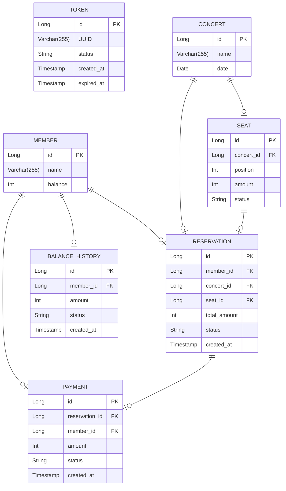

# ERD 설계

```mermaid
erDiagram
    MEMBER {
        Long id PK
        Varchar(255) name
        Int balance
    }
    TOKEN {
        Long id PK
        Varchar(255) UUID
        String status 
        Timestamp created_at
        Timestamp expired_at
    }
    CONCERT {
        Long id PK
        Varchar(255) name
        Date date
    }
    RESERVATION {
        Long id PK
        Long member_id FK
        Long concert_id FK
        Long seat_id FK
        Int total_amount
        String status 
        Timestamp created_at
    }
    SEAT {
        Long id PK
        Long concert_id FK
        Int position
        Int amount
        String status 
    }
    BALANCE_HISTORY {
        Long id PK
        Long member_id FK
        Int amount
        String status 
        Timestamp created_at
    }
    PAYMENT {
        Long id PK
        Long reservation_id FK
        Long member_id FK
        Int amount
        String status 
        Timestamp created_at
    }

    MEMBER ||--o| RESERVATION : ""
    MEMBER ||--o| BALANCE_HISTORY : ""
    MEMBER ||--o| PAYMENT : ""
    CONCERT ||--o| SEAT : ""
    CONCERT ||--o| RESERVATION : ""
    SEAT ||--o| RESERVATION : ""
    RESERVATION ||--o| PAYMENT : ""
    

```
