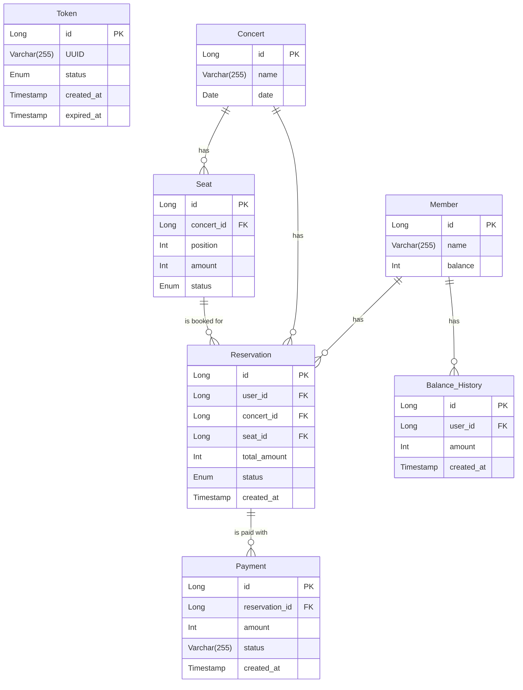

# ERD 설계

```mermaid
erDiagram
    Member {
        Long id PK
        Varchar(255) name
        Int balance
    }

    Token {
        Long id PK
        Varchar(255) UUID 
        Enum status
        Timestamp created_at
        Timestamp expired_at
    }

    Concert {
        Long id PK
        Varchar(255) name
        Date date
    }

    Reservation {
        Long id PK
        Long user_id FK
        Long concert_id FK
        Long seat_id FK
        Int total_amount
        Enum status
        Timestamp created_at
    }

    Seat {
        Long id PK
        Long concert_id FK
        Int position
        Int amount
        Enum status
    }

    Balance_History {
        Long id PK
        Long user_id FK
        Int amount
        Timestamp created_at
    }

    Payment {
        Long id PK
        Long reservation_id FK
        Int amount
        Varchar(255) status
        Timestamp created_at
    }

    Member ||--o{ Reservation : "has"
    Concert ||--o{ Reservation : "has"
    Seat ||--o{ Reservation : "is booked for"
    Member ||--o{ Balance_History : "has"
    Reservation ||--o{ Payment : "is paid with"
    Concert ||--o{ Seat : "has"

```
