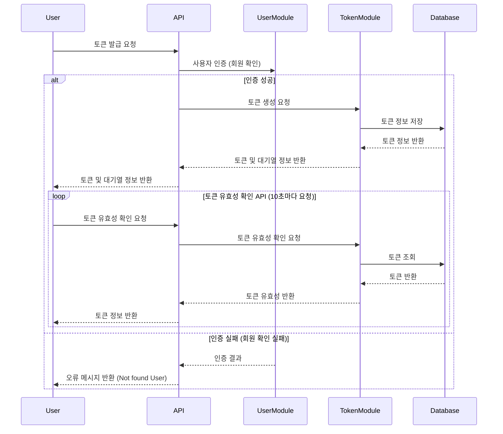
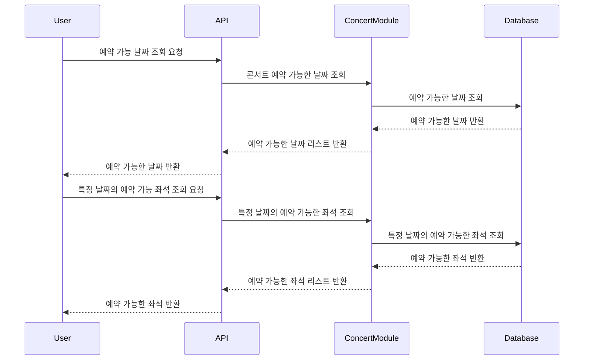
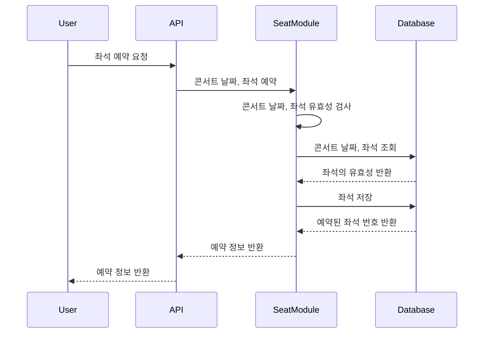
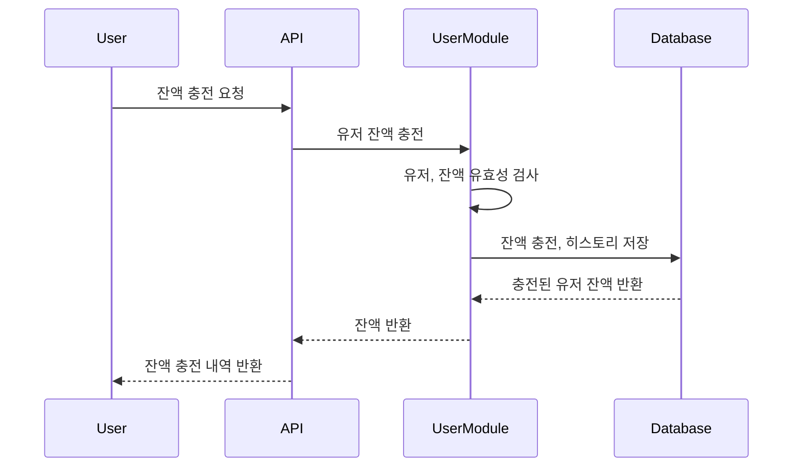
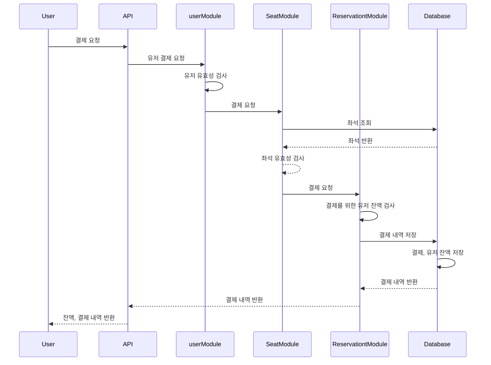

# 시퀀스 다이어그램

### 유저 토큰 발급 API

```mermaid
    sequenceDiagram
        participant User as User
        participant API as API
        participant UserModule as UserModule
        participant TokenModule as TokenModule
        participant Database as Database
    
        User->>API: 토큰 발급 요청
        API->>UserModule: 사용자 인증 (회원 확인)
        alt 인증 성공 
            API->>TokenModule: 토큰 생성 요청
            TokenModule->>Database: 토큰 정보 저장
            Database-->>TokenModule: 토큰 정보 반환
            TokenModule-->>API: 토큰 및 대기열 정보 반환
            API-->>User: 토큰 및 대기열 정보 반환
            loop 토큰 유효성 확인 API (10초마다 요청)
                User->>API: 토큰 유효성 확인 요청
                API->>TokenModule: 토큰 유효성 확인 요청
                TokenModule->>Database: 토큰 조회
                Database-->>TokenModule: 토큰 반환
                TokenModule-->>API: 토큰 유효성 반환
                API-->>User: 토큰 정보 반환
            end
        else 인증 실패 (회원 확인 실패)
            UserModule-->>API: 인증 결과
            API-->>User: 오류 메시지 반환 (Not found User)
        end
```

### 예약 가능 날짜 / 좌석 API (토큰 발급 전제)

```mermaid
    sequenceDiagram
        participant User as User
        participant API as API
        participant ConcertModule as ConcertModule
        participant Database as Database
        User->>API: 예약 가능 날짜 조회 요청
        API->>ConcertModule: 콘서트 예약 가능한 날짜 조회
        ConcertModule->>Database: 예약 가능한 날짜 조회
        Database-->>ConcertModule: 예약 가능한 날짜 반환
        ConcertModule-->>API: 예약 가능한 날짜 리스트 반환
        API-->>User: 예약 가능한 날짜 반환
        User->>API: 특정 날짜의 예약 가능 좌석 조회 요청
        API->>ConcertModule: 특정 날짜의 예약 가능한 좌석 조회
        ConcertModule->>Database: 특정 날짜의 예약 가능한 좌석 조회
        Database-->>ConcertModule: 예약 가능한 좌석 반환
        ConcertModule-->>API: 예약 가능한 좌석 리스트 반환
        API-->>User: 예약 가능한 좌석 반환
```

### 좌석 예약 요청 API (토큰 발급 전제)

```mermaid
    sequenceDiagram
        participant User as User
        participant API as API
        participant SeatModule as SeatModule
        participant Database as Database
        User->>API: 좌석 예약 요청
        API->>SeatModule: 콘서트 날짜, 좌석 예약
        SeatModule->>SeatModule: 콘서트 날짜, 좌석 유효성 검사
        SeatModule->>Database: 콘서트 날짜, 좌석 조회
        Database-->>SeatModule: 좌석의 유효성 반환
        SeatModule->>Database: 좌석 저장
        Database-->>SeatModule: 예약된 좌석 번호 반환
        SeatModule-->>API: 예약 정보 반환
        API-->>User: 예약 정보 반환
```

### 잔액 충전 / 조회 API (토큰 발급 전제)

```mermaid
    sequenceDiagram
        participant User as User
        participant API as API
        participant UserModule as UserModule
        participant Database as Database
        User->>API: 잔액 충전 요청
        API->>UserModule: 유저 잔액 충전
        UserModule->>UserModule: 유저, 잔액 유효성 검사
        UserModule->>Database: 잔액 충전, 히스토리 저장
        Database-->>UserModule: 충전된 유저 잔액 반환
        UserModule-->>API: 잔액 반환
        API-->>User: 잔액 충전 내역 반환
```

### 결제 API (토큰 발급 전제)

```mermaid
    sequenceDiagram
        participant User as User
        participant API as API
        participant userModule as userModule
        participant SeatModule as SeatModule
        participant ReservationtModule as ReservationtModule
        participant Database as Database
        User->>API: 결제 요청
        API->>userModule: 유저 결제 요청
        userModule->>userModule: 유저 유효성 검사
        userModule->>SeatModule: 결제 요청
        SeatModule->>Database: 좌석 조회
        Database-->>SeatModule: 좌석 반환
        SeatModule-->>SeatModule: 좌석 유효성 검사
        SeatModule->>ReservationtModule: 결제 요청
        ReservationtModule->>ReservationtModule: 결제를 위한 유저 잔액 검사
        ReservationtModule->>Database: 결제 내역 저장
        Database->>Database: 결제, 유저 잔액 저장
        Database-->>ReservationtModule: 결제 내역 반환
        ReservationtModule-->>API: 결제 내역 반환
        API-->>User: 잔액, 결제 내역 반환
```

